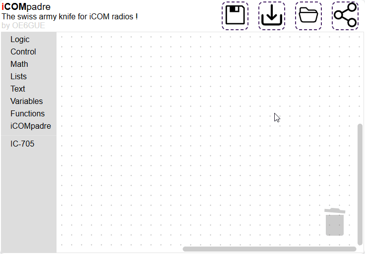

# Overview

iCOMpadre-studio is the code editor for iCOMpadre and it runs usually of the SD card in the PROGRAM mode. There it produces the `main.lua` file which is executed in RUN mode.

## General usage

The interface is easy to use. On the left pane there is a selection of [blocks](/studio/blocks/) that can be dragged to the workspace and there they can be connected to meaningful programs. Lets have a look how a RF Gain Limiter to 30% for the IC-705 can be implemented in 60 seconds: 

These blocks can be put together to get a running program. [First steps with blockly](https://www.youtube.com/watch?v=lPVJjQbEeN0) gives a good introduction how this works.

Depending which, and how the blocks are joined togehter iCOMpadre-studio creates a `main.lua` file which is stored on the sd card.
When iCOMpadre is started up the next time in the run mode, then this file will be executed.

### Action Buttons

The Dashed Buttons 

| Button                      | Functionality                 |
|-----------------------------|-------------------------------|
|     | The **save** button compiles the current sketch and uploads it to iCOMpadre. If a user drops a lua file onto this button then this code will be uploaded an ran on the microcontroller.|    
|     | The **download** button downloads the current sketch to the file. The filename is dynamically created (appended with date). If the user presses the `ctrl` button during the press of this button then there will be the lua script exported.|
|     | The **open** button replaces the current sketchwith the one that the user selects from the local disk. |
|     | The **share** button shows the current sketch as text, where it can be shared via mail, patebin or other techniques. If the user presses the `ctrl` button during the press of this button then the lua script will be exported. |

## Sharing Recipies

If you have a cool solution that you want to share with others, please do so, by pasting it onto [pastebin](https://pastebin.com/) with the hashtag `#icompadre`. The title should give a hint what the solution is about.

## Updates

You can always update the version by downloading the newest [version from GitHub](https://github.com/bytebang/iCOMpadre-studio/releases) onto a SD card and by inserting it into iCOMpadre. Read the update notes to detect breaking changed which may lead to data loss.

## Legal

This software is dual licensed:

#### AGPLv3 for private use:

You may use, copy, modify, and distribute this software under the terms of the Affero General Public License Version 3 (AGPLv3). The AGPLv3 requires that modified code, when provided over a network, be released under the AGPLv3 as well. For more information, see the AGPLv3 license file.

#### Proprietary license for commercial use:

A separate proprietary license is available for commercial use of this software. The proprietary license grants you additional rights and restrictions beyond the provisions of the AGPLv3. Please contact us for information on commercial licensing.

#### Discalimer
IMPORTANT: I DO NOT ASSUME ANY RESPONSIBILITY FOR YOUR USE OF THIS SOFTWARE, AND I MAKE NO REPRESENTATIONS ABOUT ITS SAFETY, APPROPRIATENESS, OR USE FOR A PARTICULAR PURPOSE. USE OF THIS SOFTWARE IS AS-IS.